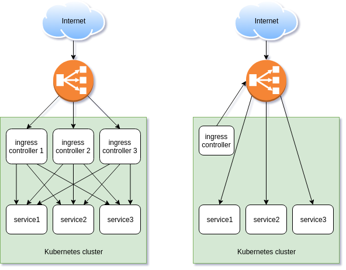

## ingress-terraform

A Kubernetes ingress controller, which allows to manage LBaaS resources using the Terraform.

## Overview

The project is still in early alpha. There can be significan code and behavior changes.

Since the LBaaS resources is not the part of the Kubernetes cluster, regular services cannot be accessed. Therefore if you want to expose the service for the loadbalancer, you have to expose it as a [node port](https://kubernetes.io/docs/concepts/services-networking/service/#nodeport).

Config [examples](/examples).

## Why

Loadbalancers can be created within the Kubernetes Cloud Providers, but their configuration is not flexible. Moreover the ingress-terraform allows to create one loadbalancer for multiple services.

## Supported clouds

* OpenStack

## Features

* TLS certificates (`TERMINATED_HTTPS`)
* TCP listeners
* Templated terraform script

## Comparison with a regular ingress controller

On the left side is a regular ingress controller, which resides inside the Kubernetes cluster.

On the right side is a Terraform ingress controller. It doesn't receive the ingress traffic, but only manages the loadbalancer. If Terraform ingress controller is down, the loadbalancer will still work.

Each Kubernetes ingress resource represents a loadbalancer.

## TODO

* Handle signals, e.g. wait for terraform to finish, when ingress controller received the exit signal
* Add finalizer to the ingress resource
* Add intermediate CA support (so far they can be concatenated into the certificate)
* Output terraform script diff
* Prepend logging loadbalancer UID
* Put openstack secrets into the secret and watch for its modification
* Add terraform execution time measurements
* Add additional annotations into ingress to pass custom resources into the template
* Remove OpenStack-only requirement
* Add more watchers and update loadbalancers on tls/node/secret/configmap change events
* Add parallel workers
* Add tests
* Proper logging

## Credits

The current project is based on the [octavia-ingress-controller](https://github.com/kubernetes/cloud-provider-openstack/blob/master/docs/using-octavia-ingress-controller.md) code.
